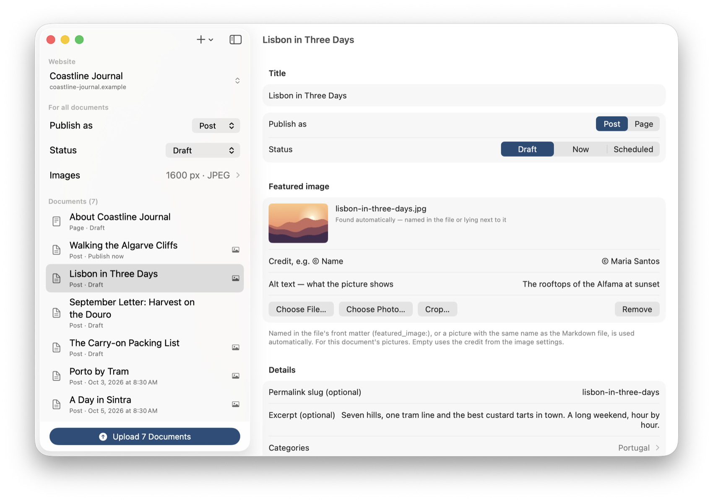
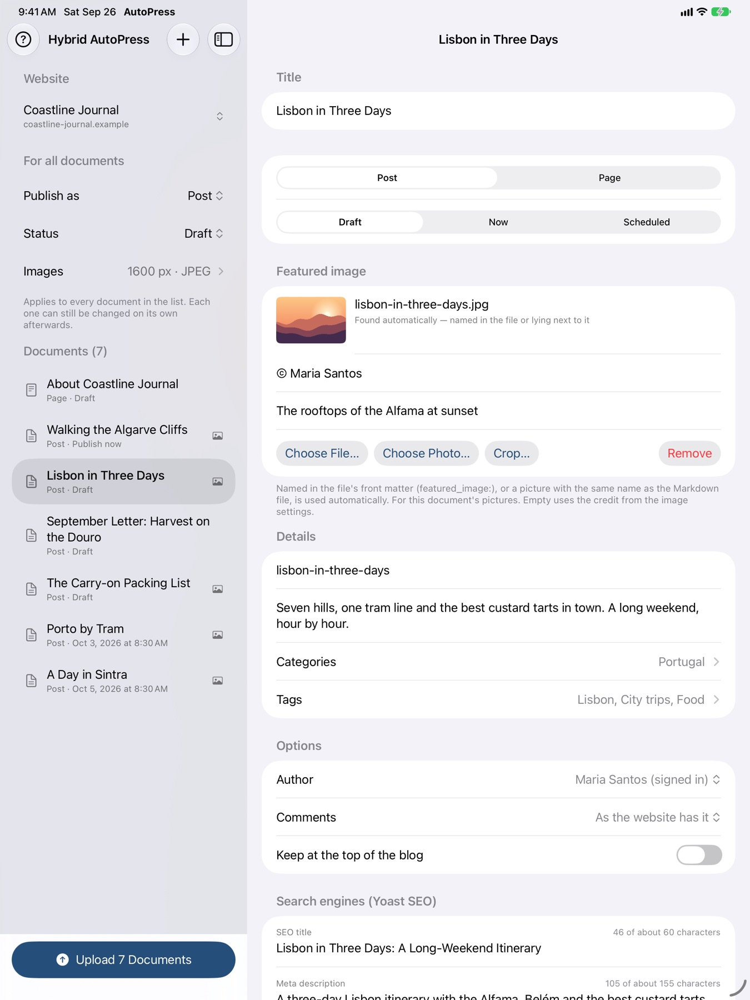
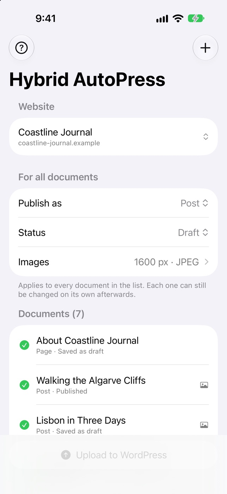

# Hybrid AutoPress website

The one-page site for [Hybrid AutoPress](https://hybrid-autopress.com/), the app that
uploads many Markdown files to WordPress at once, for iPhone, iPad and Mac.

Live: <https://hybrid-autopress.com/> (English), plus /de/, /fr/, /es/, /it/, /pt/, /nl/, /ja/ and /zh/, the nine languages of the app.

## How it is built

Plain HTML, CSS and a little JavaScript: no framework, no dependencies, served by GitHub Pages
straight from `main`.

```
template.html          the structure of the page, with {{placeholders}}
template-privacy.html  the structure of the app's privacy policy
texts.py, lang/*.py    the words of the page: English and German in texts.py, the rest one file per language
privacy.py, lang/*.py  the words of the app's privacy policy (German is the binding version)
build.py               writes index.html, <lang>/index.html, datenschutz-app/<lang>/index.html and sitemap.xml
assets/style.css       design: navy #1A3A5E / #254E7A and amber #F59E0B from the app icon
assets/site.js         reveal on scroll, the pinned walkthrough, the hero zoom
assets/img/            app icon and screenshots (Mac, iPad, iPhone)
impressum/             the legal notice (German law), a static page in the same design
datenschutz/           the privacy policy for the website, likewise static
serve.js               tiny static server for a local preview: node serve.js
```

Change words in `texts.py`, `privacy.py` or `lang/<code>.py`, structure in the templates, then:

```bash
python3 build.py
```

Every `index.html` outside `impressum/` and `datenschutz/` is generated. Do not edit them by hand. A further
language is one more entry in `LANGUAGES` in `build.py` and one more file in `lang/`.

## The scroll

Every section is a full-height panel and a resting point (`scroll-snap`, proximity). In
“How it works” the Mac window stays pinned while four steps scroll past and swap the screenshot.
On small screens and with “reduce motion” the page falls back to a plain, linear scroll.

## Screenshots

| Mac | iPad | iPhone |
|---|---|---|
|  |  |  |

Taken from debug builds of the app with its demo launch arguments (`-demoFolder`, `-demoSite`,
`-demoSelect`, `-demoUpload`) against the mock WordPress from the app repository; sheets and
windows beyond that were opened by UI scripting on the Mac and by taps in the simulators. The content
(“Coastline Journal”) is sample content; the pictures in it are drawn by a script.

© 2026 Pascal Hugo
